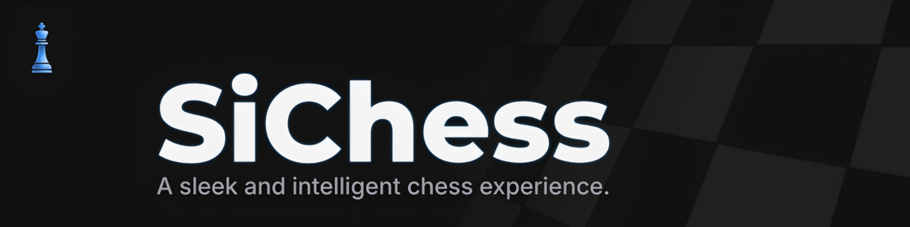
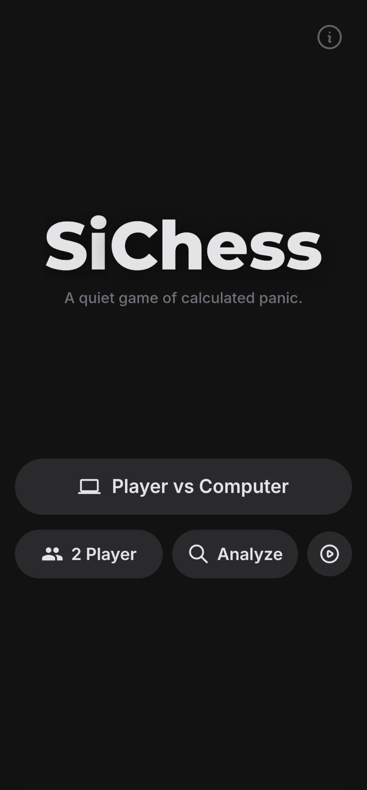
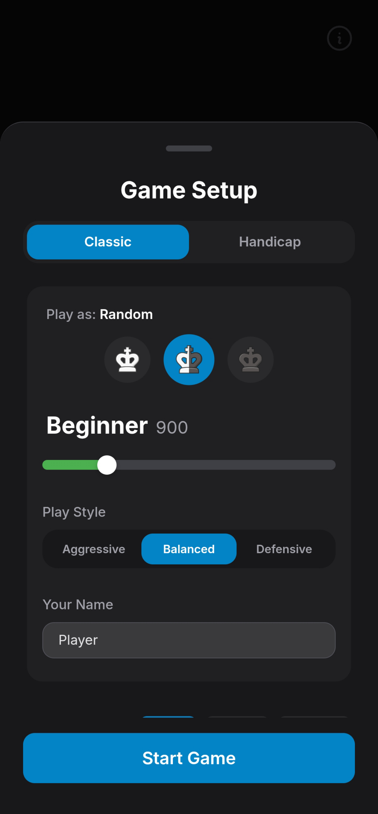
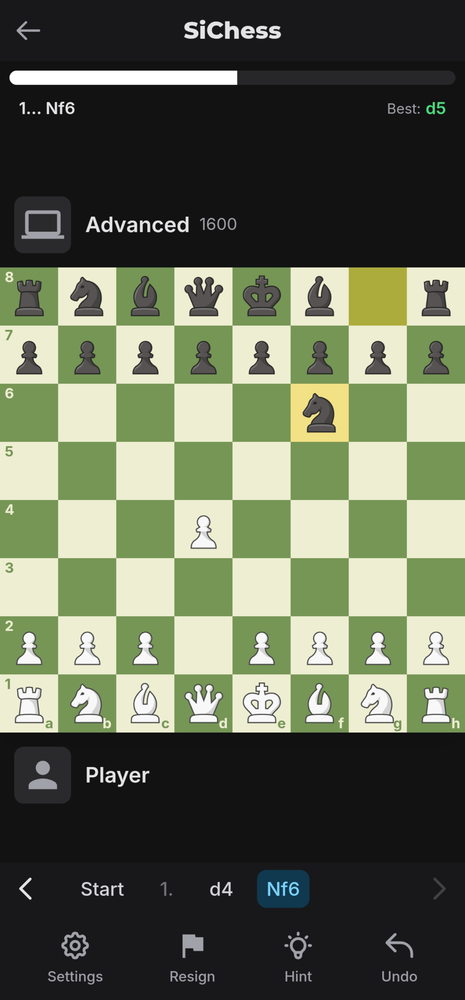
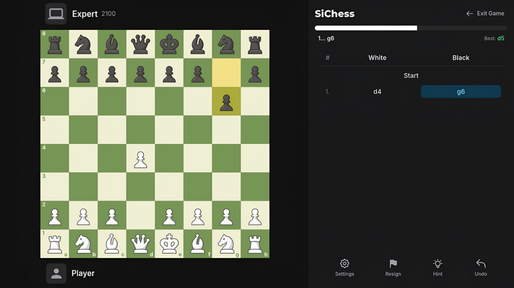

<div align="center">



# SiChess

**A sleek and intelligent chess experience powered by cutting-edge web technology.**

[](https://reactjs.org/)
[](https://www.typescriptlang.org/)
[](https://vitejs.dev/)
[](https://stockfishchess.org/)
[](LICENSE)
[]()

<br />

### 🔴 [**Play Live Now**](https://sichess.netlify.app) 🔴

*Fully optimized for Desktop, Tablet, and Mobile devices*

[Overview](#-overview) • [Features](#-key-features) • [Screenshots](#-screenshots) • [Tech Stack](#%EF%B8%8F-technology-stack) • [How to Play](#-how-to-play) • [Structure](#%EF%B8%8F-project-structure) • [Contributing](#-contributing)

</div>

---

## 🎯 Overview

**SiChess** is a professional-grade chess web application that brings desktop-class performance to your browser. Built with React 19 and powered by Stockfish 17.1 running in WebAssembly, it delivers lightning-fast move calculation, deep position analysis, and a beautifully crafted user experience.

Perfect for players of all levels—from beginners taking their first steps to masters analyzing complex positions and enthusiasts watching high-level engine battles.

---

## ✨ Key Features

### 🧠 **World-Class Chess Engine**
- **Stockfish 17.1 via WebAssembly:** Zero-latency move calculation running entirely in your browser
- **26 Calibrated Difficulty Levels:** From 250 ELO (Beginner) to 3200 ELO (Ultimate)
- **Intelligent Error Modeling:** Human-like play at lower levels with phase-aware mistakes (opening/middlegame/endgame)
- **Dual-Engine Architecture:** Separate engines for gameplay and background evaluation ensure smooth performance

### 🎭 **Dynamic Play Styles**
- 🛡️ **Defensive:** Safety-first positional chess with castling priority and avoiding complications
- ⚔️ **Aggressive:** Tactical fireworks with preference for checks, captures, and sacrifices
- ⚖️ **Balanced:** Optimal strategic play without style bias

### 📊 **Professional Analysis Suite**
- **Deep Game Review:** Analyze every position with configurable engine depth (up to 22 ply)
- **10-Tier Move Classification System:**
  - 💎 Brilliant (sacrifices), ⭐ Great (underpromotions)
  - ✅ Best, 🟢 Excellent, Good moves
  - ⚠️ Inaccuracies, ❌ Mistakes, ❗ Misses (winning chances lost)
  - 💥 Blunders
- **Accuracy Metrics:** Winning probability-based accuracy calculation for both players
- **Visual Game Flow Chart:** Track evaluation swings throughout the game
- **Live Move Feedback:** Real-time best move suggestions and position evaluation
- **PGN Analysis:** Import games from other platforms for instant analysis

### 🎮 **Versatile Game Modes**

#### **Player vs Computer (PvC)**
- Choose your color (White, Black, or Random)
- Adjustable difficulty from beginner to superhuman
- Hints and takebacks to help you learn
- **Handicap Mode:** Remove pieces (Queen, Rooks, Bishops, Knights, Pawns) for odds games

#### **Player vs Player (PvP)**
- Local multiplayer on the same device
- Optional piece rotation for over-the-board feel
- Custom time controls for blitz to classical games

#### **Spectator Mode (CvC)**
- Watch two engines battle with independent difficulties and styles
- Pause and navigate through the game
- Perfect for studying engine lines or entertainment

#### **Special Variants**
- **Chess960 (Fischer Random):** 960 starting positions with proper castling rules
- **Time Controls:** None, 10-minute, or fully custom settings (1-99 minutes per side)

### 🎨 **Premium User Experience**
- **Adaptive Layouts:** Intelligent portrait (mobile) and landscape (desktop/tablet) interfaces
- **Smooth Animations:** Piece sliding with castling coordination and capture fade-outs
- **Promotion Interface:** Visual piece selection tray with intelligent positioning
- **High-Quality Audio:** Distinct sounds for moves, captures, castling, checks, and game events
- **Modern Dark Theme:** Eye-friendly design with glassmorphism effects
- **Evaluation Bar:** Real-time position advantage visualization
- **Legal Move Indicators:** Visual guides for valid moves and captures
- **King Check Highlighting:** Instantly see when kings are in danger

### 🔧 **Customization Options**
- Toggle evaluation bar, move feedback, and hints
- Enable/disable takebacks (undo moves)
- Piece rotation for PvP games
- Adjustable time controls
- Chess960 variant toggle
- Persistent settings across sessions

### 📤 **PGN Support**
- **Import:** Load games from Chess.com, Lichess, or any PGN file
- **Export:** Share games with full metadata (Event, Site, Date, Result, Time Control, Termination)
- **Web Share API:** Instant sharing on mobile devices

---

## 📸 Screenshots

<div align="center">

### **Mobile Experience**

<p>
  
  &nbsp;&nbsp;&nbsp;
  
  &nbsp;&nbsp;&nbsp;
  
</p>

<em>Mobile Interface: Landing • Setup • Gameplay</em>

---

### **Desktop Experience**


<em>Desktop Interface: Full-featured layout with move history sidebar and analysis tools</em>

</div>

---

## 🛠️ Technology Stack

### **Frontend Core**
- **React 19.2** - Latest React with concurrent features
- **TypeScript 5.8** - Type-safe development
- **Vite 6.2** - Lightning-fast build tooling
- **Tailwind CSS** - Utility-first styling

### **Chess Engine & Logic**
- **Stockfish.js (WebAssembly)** - World's strongest chess engine
- **chess.js 1.4** - Move generation and validation
- **Custom UCI Implementation** - Direct Stockfish communication via Web Workers

### **Architecture Highlights**
- **Dual-Engine Design:** Separate workers for gameplay and evaluation prevent blocking
- **Queue-Based Task Management:** Prioritized engine requests with graceful error handling
- **Multi-PV Analysis:** Evaluates multiple candidate moves for realistic human play
- **Phase-Aware Error Modeling:** Different mistake probabilities for opening/middlegame/endgame
- **Reactive State Management:** Custom hooks for complex game state
- **Service Layer Pattern:** Clean separation of concerns (engine, analysis, sound)

---

## 🎯 How to Play

### **Quick Start**
1. **Select Mode:** Choose PvC (vs Computer), PvP (2 Player), Spectate (Engine Battle), or Analyze (Import PGN)
2. **Configure:** Set names, colors, difficulty, and time controls
3. **Play:** Drag-and-drop or click-to-move pieces
4. **Analyze:** After the game, review with move classifications and best move suggestions

### **Controls**
- ⚙️ **Settings** - Customize features • 💡 **Hint** - See best move • ↩️ **Undo** - Take back moves
- 🏳️ **Resign** - End game • ⏸️ **Pause** - Freeze spectator mode • 📤 **Share** - Export PGN

### **Features**
- **Move Navigation:** Click move list or use chevrons to browse history
- **Analysis Mode:** Deep review with accuracy stats, game flow chart, and move classifications
- **Time Controls:** Choose None, 10 min rapid, or custom times (1-99 min per side)
- **Hints & Feedback:** Real-time evaluation and best move arrows (can be toggled)

---

## 🏗️ Project Structure
```
sichess/
├── public/
│   ├── stockfish.js          # Stockfish engine
│   ├── stockfish.wasm         # WebAssembly binary
│   └── assets/
│       ├── pieces/            # Chess piece images
│       └── sounds/            # Game audio files
├── src/
│   ├── App.tsx                # Main application component
│   ├── types.ts               # TypeScript definitions
│   ├── components/            # React components
│   │   ├── Board.tsx          # Chess board with drag-drop
│   │   ├── GameOverModal.tsx  # End game interface
│   │   ├── GameReviewModal.tsx # Analysis summary
│   │   ├── NameInputModal.tsx # Game setup
│   │   └── ...                # 20+ specialized components
│   ├── hooks/
│   │   ├── useChessGame.ts    # Core game state logic
│   │   └── useViewport.ts     # Responsive layout
│   └── services/
│       ├── chessEngine.ts     # Stockfish integration
│       ├── analysisService.ts # Game analysis logic
│       └── soundManager.ts    # Audio playback
├── index.html
├── vite.config.ts
└── package.json
```

---

## 🎓 Development Highlights

### **Custom Features**

#### **Human-Like AI**
Lower difficulty levels use a sophisticated error model with phase-aware mistakes, weighted error selection, and multi-PV candidate evaluation to simulate realistic human play.

#### **Style-Based Play**
Play styles influence move selection beyond raw evaluation—Aggressive prioritizes attacks, Defensive favors safety, and Balanced uses pure engine logic.

#### **Dual-Engine Architecture**
Two independent Stockfish workers prevent UI blocking: **gameEngine** for high-priority moves and **evalEngine** for background analysis.

#### **Advanced Animation System**
Smooth piece transitions, coordinated castling, capture fade-outs, and intelligent promotion tray positioning for a polished experience.

### **Technical Achievements**
- Custom UCI protocol implementation with Web Workers
- Winning probability model for move classification (sigmoid function)
- Robust PGN parsing with Chess960 support
- Complex state management with history navigation
- Responsive design with adaptive portrait/landscape layouts
- React 19 concurrent rendering for 60 FPS gameplay

---

## 🤝 Contributing

Contributions are welcome and appreciated — they help the project grow and improve.

Because this project uses the **GPL-3.0 License**, any contributions must also remain open-source under the same license.

### 🔧 How to Contribute

1. **Fork** the repository  
2. Create a feature branch → `git checkout -b feature/AmazingFeature`  
3. **Commit** your changes → `git commit -m "Add AmazingFeature"`  
4. Push the branch → `git push origin feature/AmazingFeature`  
5. Open a **Pull Request**

### 💡 Possible Contribution Ideas

- 🌐 Multi-language support (i18n)
- 🎨 Additional piece sets & board themes
- 📊 Opening book with ECO classification
- 💾 Cloud save, profile & history sync
- 🏆 Puzzle / tactics trainer
- 📈 Game analytics & visual statistics
- ♟️ Online multiplayer (WebRTC/WebSockets)

**Bug Reports:** Open an issue with description, reproduction steps, expected behavior, and device/browser info.

---

## 📄 License

This project is licensed under the **GNU General Public License v3.0 (GPL-3.0)**.

By participating in this project (including submitting pull requests), you agree that your contributions will be distributed under the same GPL-3.0 license.

See the `LICENSE` file for full legal terms.

---

## 🙏 Acknowledgments

- **Stockfish Team** - For the incredible open-source chess engine
- **chess.js Contributors** - For reliable move generation
- **Chess.com & Lichess** - For UI/UX inspiration and design patterns

---

## 📞 Contact

**Siddhant** - [GitHub Profile](https://github.com/siddhantdg)

**Email:** [siddhantdigraje77@gmail.com](mailto:siddhantdigraje77@gmail.com)
**Project Link:** [https://github.com/siddhantdg/sichess](https://github.com/siddhantdg/sichess)

---

<div align="center">

**Built with ❤️ using React, TypeScript, and Stockfish**

⭐ **Star this repo if you find it useful!** ⭐

</div>